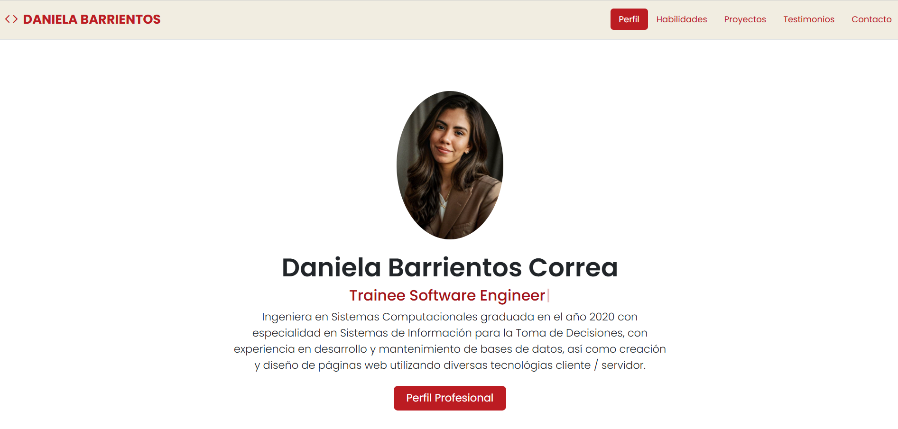

## Portafolio de proyectos

¡Hola! Soy **Daniela Barrientos Correa**, soy Ingeniera en Sistemas Computacionales graduada en el año 2020 con especialidad en Sistemas de Información para la Toma de Decisiones. Aquí encontrarás información sobre mi.

___

## Secciones del proyecto:

- 💪🏼 Habilidades 
- 📚 Proyectos
- 🙋🏻 Testimonios
- ✉️ Contacto 

## Teconologías:
- HTML
- CSS
- JavaScript

<a href="https://developer.mozilla.org/en-US/docs/Web/JavaScript" target="_blank">  </a>

## Vista Previa

## Contacto

Si tienes dudas, sugerencias o simplemente quieres colaborar, escríbeme a [**bacdaniela@gmail.com**](mailto:bacdaniela@gmail.com)

¡Espero pronto saber de ti! 😊

### Creado en el bootcamps de TecnolochicasPro💜

[TecnolochicasPro](https://tecnolochicas.mx/)

